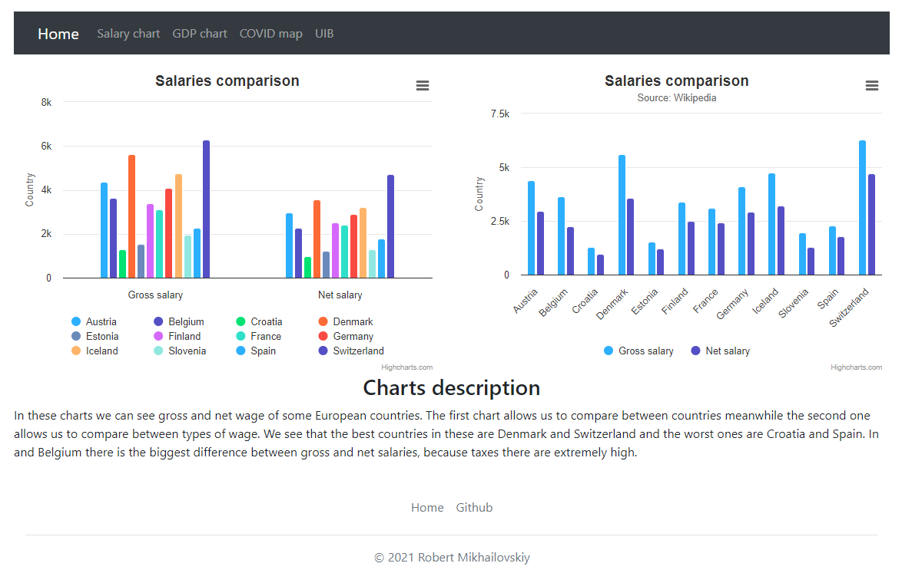

# Dashboard web application

## Description

The purpose of  this web application is to show a dashboard, which includes some charts of different types. These charts show some data of twelve European countries. There are three pages with charts:
* **Salary**. The chart on the left side allows us to compare salaries by country, and the chart of the right side shows us the comparison between gross and net salary of each country.
* **GDP**. This pie chart allows us to compare Gross Domestic Product (nominal) for each country.
* **Population**. This map gives us a vision of the population of each country.
* The footer contains two links: the first one redirects to home page and the second one is my Github link.



### Technology

The front-end part was build using:
* HTML5
* Bootstrap 5
* Javascript

The backend part was build using Java Spring framework. It allows to create well structured web applications, however it's more difficult than PHP. Here is a little explanation of each package:
* **Controller**. The controller allows us to intercept HTML hyperlinks and assign a view to each. Every local direction must have a method which controls it.
* **Entity**. This package allows us to define data models. In this case, we have one class Country which has four attributes: name, GDP, gross wage and net wage.
* **Repository**. The content of this package allows us to make structured connections to MySQL database. The interface already has all methods we are going to need, so no need to create new methods or override any.
* **Webapp**. This package contains all views and front-end sources, such as scripts and images. Each view file has *.jsp* extension (Java Server Page). These files are executed by Java Machine and converted into HTML. In this files we can write Java code using JSTL library. For example, we need it to iterate over all countries to generate data for our Javascript.
```
xAxis: {
  categories: [
  //Java code which generates all the categories
  <c:forEach var="country" items="${countries}">
    <c:out value="` ${country.name} `,"/>
  </c:forEach>
  ]
},
```
The variable *countries* is a list of objects of type **Country** created by a controller before. Also, JSTL is used to include one *.jsp* into another.


## Installing and executing

* Install XAMPP or MySQL Workbench
* Load [this database](https://github.com/morj12/adiiu-charts-spring/blob/main/country_info.sql)
* Open the project with Intellij Idea
* Run it
* Go to localhost:8080/

## Accesibility analysis

We are going to analyze some accesibility and quality parameters of the front-end part.

### Alternative text for images

All images of the application are flags of countries. The code is ubicated [here](src/main/webapp/countries.jsp)
Each has an alternative tag on, so if the images are disabled, there will be a short description.

### Charts with information

Each chart has a title, a description and the data source is also included. 

### Using only keyboard

The application is fully compatible with the keyboard. You can have access to each page without a mouse.

### Responsiveness

The application is built using Bootstrap. It means that it's totally responsive and containers' size is adapted to every screen. When you access the page via mobile phone, the menu bar convert into a drop-down bar with a button. The charts size also depends on your screen size.

### Deactivating CSS

If we deactivate CSS, we are still able to read all the content of the page because all HTML content is in the right order.

### Content ease

The application is easy, as it has low amount of content per page. So it makes a visitor feel comfortable and not disoriented.
